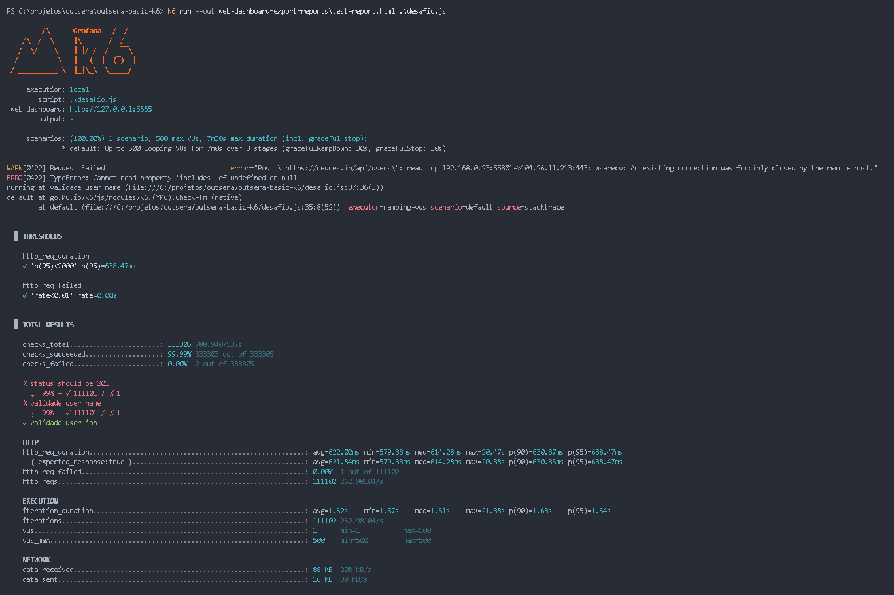
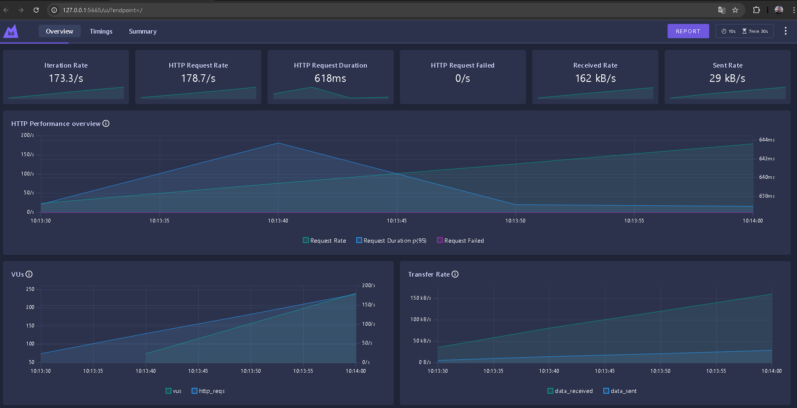

# [Outsera] Testes de performance com k6 


### Para uma execução com acompanhamento em tempo real, executar o comando de exemplo:

```sh
k6 run --out web-dashboard=export=reports\graphic-report.html .\desafio.js
```


### E acessar a seguinte URL durante a execução:
http://127.0.0.1:5665/ui/?endpoint=/



### Report em html será gerado ao fim da execução na pasta /reports


## Análise sobre o relatório anexado [AQUI](./reports/graphic-report.html):
- API teve uma vazão de pouco mais de 128 mil requisições
- 99% das requisicoes responderam em menos de 500ms
- As falhas foram abaixo de 1%
- Em todas as respostas, as regras de negócio como status_code, name e job foram validados com sucesso
- Houveram requisições que tiveram duração de até 1 minuto


---
